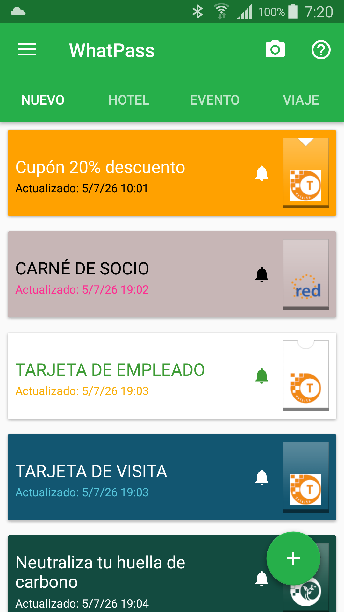
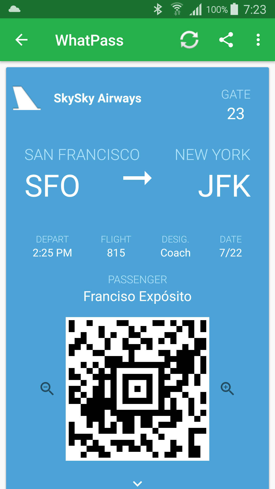
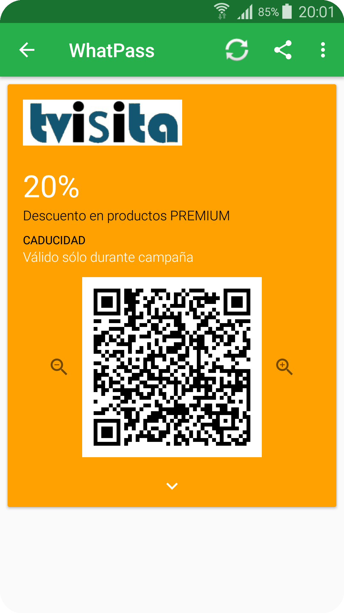
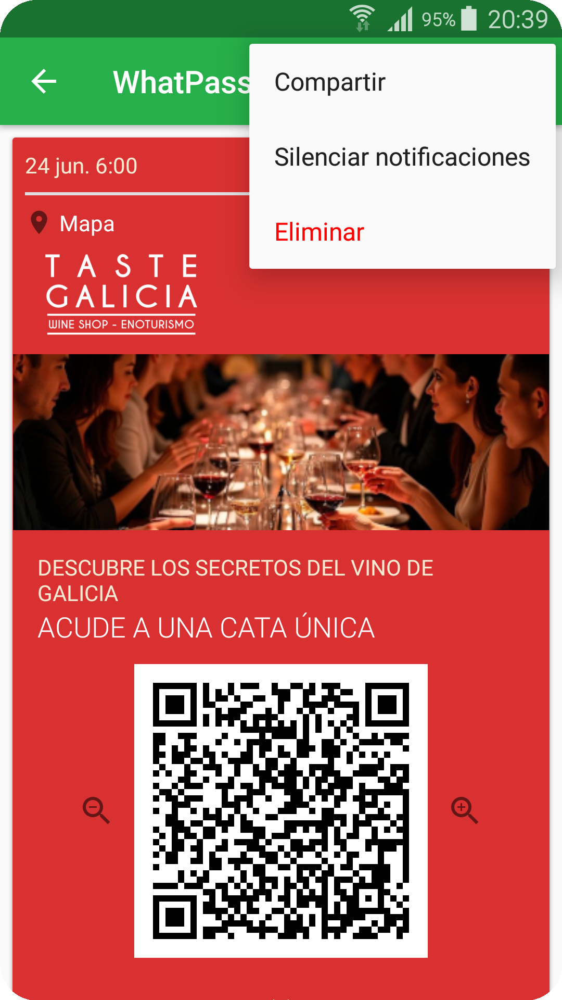
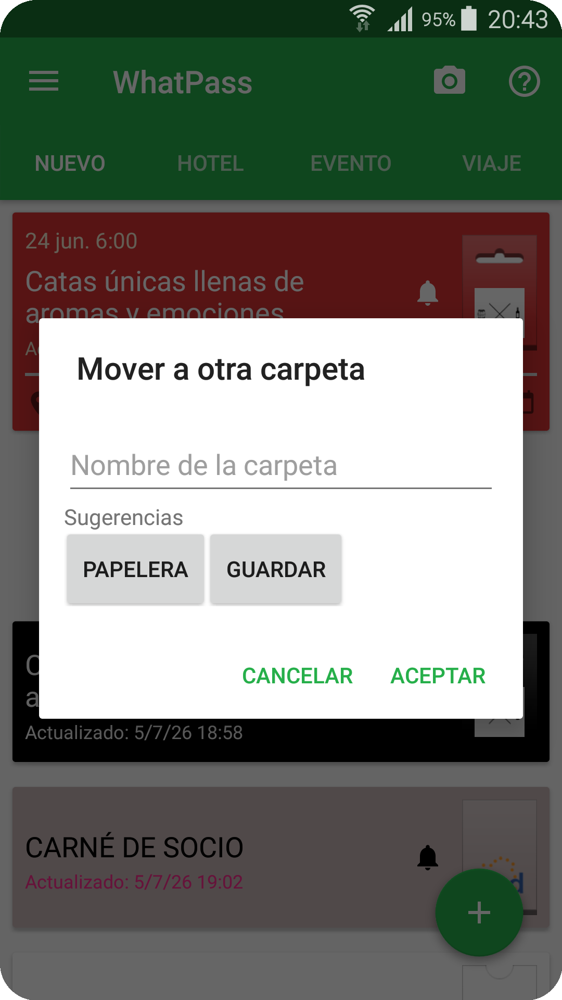
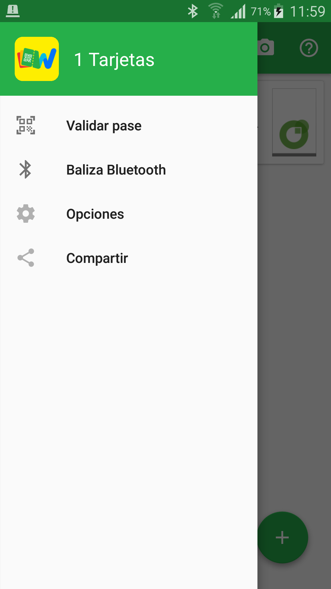
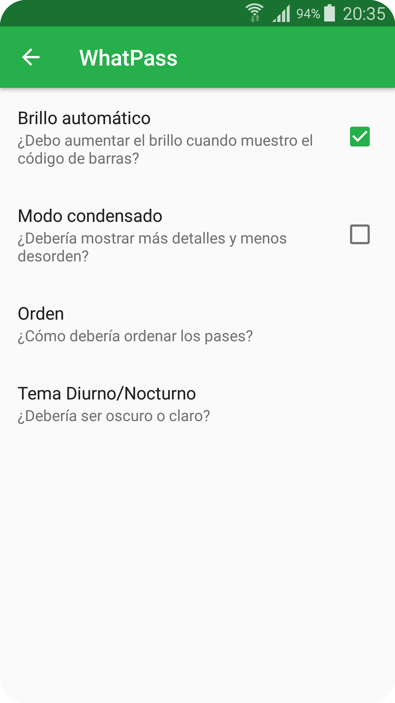
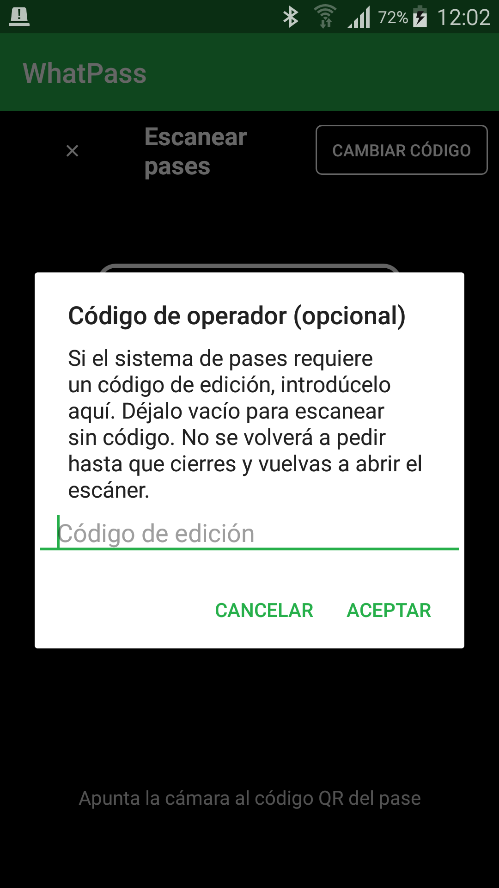
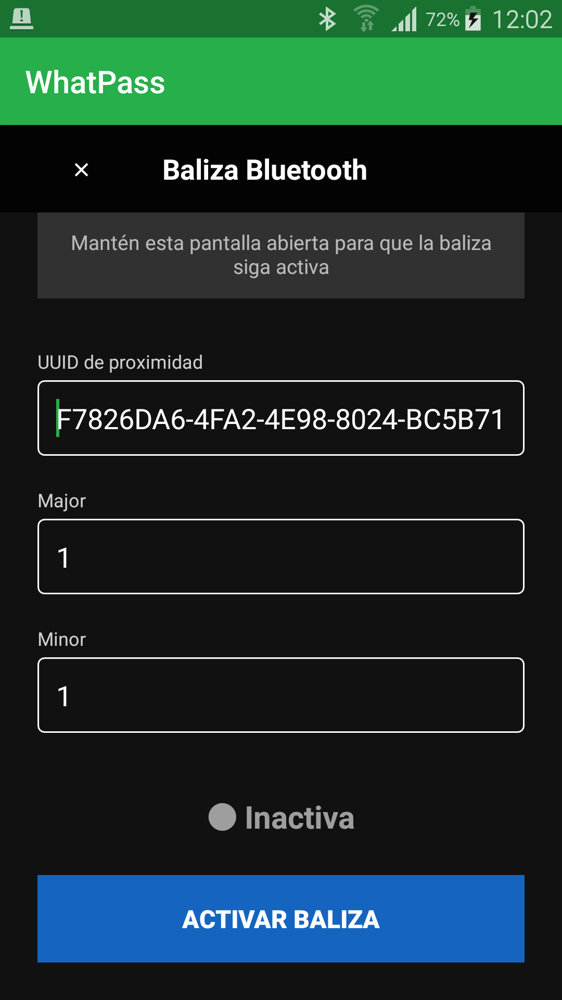

# WhatPass

**WhatPass: Tu repositorio de tarjetas digitales PKPASS para Android**

WhatPass es una aplicación para Android diseñada para almacenar, organizar y gestionar tarjetas digitales en formato PKPASS. Su objetivo es ofrecer una experiencia equivalente a las carteras digitales más avanzadas, permitiendo a los usuarios llevar siempre consigo sus tarjetas, pases, cupones y credenciales de forma segura y actualizada.

WhatPass transforma el teléfono móvil en una cartera digital inteligente capaz de sustituir tarjetas de papel o plástico por una solución moderna, sostenible y con funcionalidades avanzadas.

## Capturas de pantalla

**Repositorio de tarjetas**

**Tarjeta de embarque**

**Cupón de descuento**

**Opciones de tarjeta: compartir, silenciar y eliminar**

**Organización en carpetas**

**Menú lateral**

**Pantalla de opciones**

**Validar pase — código de operador**

**Baliza Bluetooth**

## 1. ¿Qué es un archivo PKPASS?

Un archivo PKPASS es un formato de tarjeta digital utilizado originalmente por Apple Wallet y adoptado por numerosos sistemas de identificación, fidelización y gestión de accesos.

Cada archivo PKPASS puede contener:

- Campos de información ilimitados.
- Datos personalizados para cada usuario.
- Imágenes, logotipos y elementos gráficos.
- Códigos QR, códigos de barras o códigos Aztec para identificación y validación.
- Información dinámica que puede actualizarse automáticamente.

Además de mostrar información, las tarjetas PKPASS pueden interactuar con el usuario mediante diferentes mecanismos:

- Envío de notificaciones push.
- Apertura de enlaces web.
- Envío de tarjetas a través de correo electrónico, SMS, WhatsApp u otros servicios de mensajería.
- Acceso a servicios online mediante URL personalizadas.

Las tarjetas PKPASS también pueden utilizarse como tarjetas de fidelización. Tras el escaneo de su código QR, los sistemas asociados pueden otorgar o descontar puntos, actualizar saldos, registrar visitas o modificar cualquier dato de la tarjeta. Estos cambios se reflejan automáticamente en la tarjeta digital instalada por el usuario.

## 2. ¿Cómo funciona el repositorio de PKPASS?

WhatPass actúa como un repositorio centralizado de tarjetas digitales. Sus principales funciones son:

**Almacenamiento centralizado**
Todas las tarjetas PKPASS se guardan en una única aplicación, evitando tener que buscar documentos, correos electrónicos o capturas de pantalla.

**Actualización automática**
Cuando el emisor de una tarjeta realiza cambios, WhatPass puede recibir las actualizaciones y reflejarlas automáticamente en el dispositivo.

**Recepción de notificaciones push**
Las organizaciones emisoras pueden enviar mensajes directamente a las tarjetas instaladas para comunicar promociones, recordatorios, cambios de horario, información de eventos o cualquier otra comunicación relevante.

**Eliminación de tarjetas**
Las tarjetas pueden eliminarse fácilmente cuando dejan de ser necesarias.

**Gestión de notificaciones y actualizaciones**
El usuario mantiene el control total sobre sus datos y puede:

- Activar o desactivar las actualizaciones automáticas.
- Activar o desactivar las notificaciones push.

**Accesos directos al escritorio**
WhatPass permite crear accesos directos en la pantalla principal del dispositivo para acceder rápidamente a una tarjeta concreta sin necesidad de abrir previamente la aplicación.

**Añadir evento al calendario**
Cuando una tarjeta incorpora una fecha relevante es posible enviar un evento al calendario.

**Localización en el mapa**
Cuando una tarjeta incorpora una ubicación, se permite su localización en la aplicación de mapas del dispositivo.

## 3. Ejemplos prácticos de tarjetas digitales

El formato PKPASS es extremadamente versátil y puede utilizarse en numerosos escenarios:

**Tarjetas de visita digitales**
Permiten compartir datos de contacto actualizados, enlaces web, correo electrónico y redes profesionales.

**Carnés de socio**
Ideales para asociaciones, clubes deportivos, entidades culturales y organizaciones profesionales.

**Tarjetas de empleado**
Facilitan la identificación corporativa y el acceso a servicios internos.

**Tarjetas de cliente o fidelización**
Permiten acumular y canjear puntos, registrar compras y acceder a promociones personalizadas.

**Cupones de descuento**
Los comercios pueden distribuir promociones digitales fácilmente actualizables.

**Entradas y pases para eventos**
Control de acceso mediante códigos QR para conciertos, conferencias, ferias y actividades culturales.

**Tarjetas de embarque**
Facilitan el acceso a vuelos y otros medios de transporte sin necesidad de imprimir documentos.

## ¿Cómo funciona la aplicación?

WhatPass ha sido diseñada para simplificar al máximo la gestión de tarjetas digitales.

**Incorporación de tarjetas**
Las tarjetas pueden añadirse de tres formas distintas:

- Descargando una tarjeta desde una URL.
- Abriendo un archivo PKPASS.
- Escaneando un código QR.

**Validación de tarjetas**
WhatPass incluye una función de escáner para operadores que permite validar tarjetas de forma rápida y segura, sin necesidad de abrir el navegador. Desde el menú lateral ("Validar pase"), el operador introduce una vez su código de organización y a partir de ese momento puede escanear los códigos QR de las tarjetas de los clientes para otorgar o descontar puntos, registrar accesos o cualquier otra acción que el emisor haya configurado. El resultado de la validación (éxito o error) se muestra en pantalla de forma inmediata.

**Alertas de proximidad por GPS**
Cuando una tarjeta incluye coordenadas geográficas configuradas por su emisor (por ejemplo, la dirección de un estadio o una tienda), WhatPass detecta automáticamente cuándo el usuario se encuentra cerca de ese lugar y muestra una notificación con la información relevante del pase. La detección funciona en segundo plano, incluso con la aplicación cerrada, y se realiza de forma local a través de Google Play Services sin transmitir datos de ubicación a ningún servidor propio.

**Baliza Bluetooth (iBeacon)**
WhatPass puede funcionar como una baliza Bluetooth BLE compatible con el protocolo iBeacon. Desde el menú lateral ("Baliza Bluetooth") es posible configurar el UUID, Major y Minor de la baliza y activarla para que otros dispositivos cercanos puedan detectar su presencia. Además, cuando una tarjeta incluye identificadores de baliza configurados por su emisor, la aplicación escanea señales BLE en segundo plano y muestra automáticamente la tarjeta relevante al detectar una baliza cercana. Todo el procesamiento se realiza localmente, sin transmitir información sobre las balizas detectadas.

**Organización inteligente**
Una vez instaladas, las tarjetas se almacenan en el repositorio interno de WhatPass, donde pueden organizarse según distintos criterios:

- Orden temporal.
- Nivel de urgencia.
- Tipo de tarjeta.

**Acceso rápido**
El usuario puede crear accesos directos individuales en el escritorio del dispositivo para abrir directamente las tarjetas más utilizadas.

**Comunicación en tiempo real**
WhatPass recibe las notificaciones push enviadas por los emisores de las tarjetas, permitiendo mantener la información siempre actualizada.

**Información del dorso**
Las tarjetas incorporan información al dorso que admite hipervínculos a cualquier URL. Se puede ver la información al dorso haciendo clic en el icono de flecha que se encuentra al final de la parte frontal de la tarjeta.

**Sustitución del papel y del plástico**
La digitalización de tarjetas y documentos ofrece numerosas ventajas:

- Reduce el uso de papel y plástico.
- Evita pérdidas y deterioros.
- Permite actualizaciones remotas.
- Facilita la comunicación directa con el usuario.
- Integra servicios de mensajería y enlaces interactivos.
- Incorpora programas de fidelización con gestión automática de puntos.

Gracias a estas capacidades, las tarjetas digitales PKPASS constituyen una solución moderna, sostenible y mucho más potente que las tarjetas tradicionales.

## Historia del proyecto

WhatPass nació al detectar una necesidad real dentro del ecosistema Android.

Tras comprobar que no existían aplicaciones que ofrecieran de forma conjunta todas las funcionalidades disponibles en Apple Wallet, surgió la idea de desarrollar una solución completa y abierta para Android.

El formato PKPASS es un estándar creado por Apple y requiere cumplir una serie de especificaciones técnicas para garantizar la compatibilidad entre plataformas. WhatPass ha sido desarrollada respetando dichos estándares para ofrecer la máxima compatibilidad posible y una experiencia de usuario consistente.

El objetivo del proyecto es acercar todas las ventajas de las carteras digitales modernas a los usuarios de Android mediante una aplicación potente, flexible y de código abierto.

WhatPass está basada en el proyecto [PassAndroid](https://github.com/ligi/PassAndroid), del que parte su arquitectura original.

## Licencia Open Source

WhatPass se distribuye bajo la licencia **GNU General Public License versión 3 (GPLv3)**, una licencia de software libre con copyleft que garantiza las siguientes libertades:

- Libertad para usar el software con cualquier propósito.
- Libertad para estudiar su funcionamiento y modificarlo.
- Libertad para redistribuir copias.
- Libertad para distribuir versiones modificadas.

Cualquier redistribución o modificación de WhatPass deberá mantenerse bajo la misma licencia GPLv3, asegurando que las mejoras continúen siendo software libre.

El texto completo de la licencia está disponible en el archivo [LICENSE](LICENSE) de este repositorio.

## Aviso Legal y Limitación de Responsabilidad

WhatPass es una aplicación de software libre distribuida con el objetivo de facilitar la gestión de tarjetas digitales en formato PKPASS. Salvo que la legislación aplicable disponga expresamente lo contrario, la aplicación se proporciona "tal cual" y "según disponibilidad", sin garantía expresa o implícita de ningún tipo respecto a su funcionamiento, disponibilidad, compatibilidad, continuidad, ausencia de errores o adecuación para una finalidad concreta.

Aunque los desarrolladores realizan esfuerzos razonables para garantizar la calidad y correcto funcionamiento del software, no se garantiza que la aplicación esté libre de errores, interrupciones, vulnerabilidades de seguridad o incidencias derivadas de la interacción con sistemas, dispositivos o servicios de terceros.

El usuario utiliza WhatPass bajo su exclusiva responsabilidad y asume la obligación de verificar que el uso de la aplicación resulta adecuado para sus necesidades y cumple con la normativa que le sea aplicable. Asimismo, será responsable de las tarjetas digitales que instale, de los contenidos almacenados en ellas y del uso que realice de las funcionalidades proporcionadas por la aplicación.

Los desarrolladores, colaboradores y distribuidores de WhatPass no serán responsables de los daños o perjuicios que pudieran derivarse del uso de la aplicación, de la imposibilidad de utilizarla, de errores en los datos contenidos en las tarjetas digitales, de fallos en servicios de terceros, de pérdidas de información o de actuaciones realizadas por los usuarios o por terceros mediante las tarjetas gestionadas por la aplicación, excepto en aquellos supuestos en los que la responsabilidad no pueda ser excluida o limitada conforme a la legislación aplicable.

WhatPass actúa únicamente como herramienta de almacenamiento y gestión de tarjetas digitales. Los desarrolladores no son responsables del contenido, autenticidad, validez, legalidad o exactitud de las tarjetas PKPASS emitidas por terceros, ni de las comunicaciones, promociones, programas de fidelización, sistemas de puntos, eventos o servicios asociados a dichas tarjetas.

Nada de lo dispuesto en este aviso legal limitará o excluirá cualquier responsabilidad que, de acuerdo con la normativa aplicable de la Unión Europea o del Estado miembro correspondiente, no pueda ser legalmente excluida o limitada.

No estamos afiliados con Apple - Passbook/Wallet puede ser una marca de Apple, pero el formato PKPASS fue introducido como un estándar abierto.
